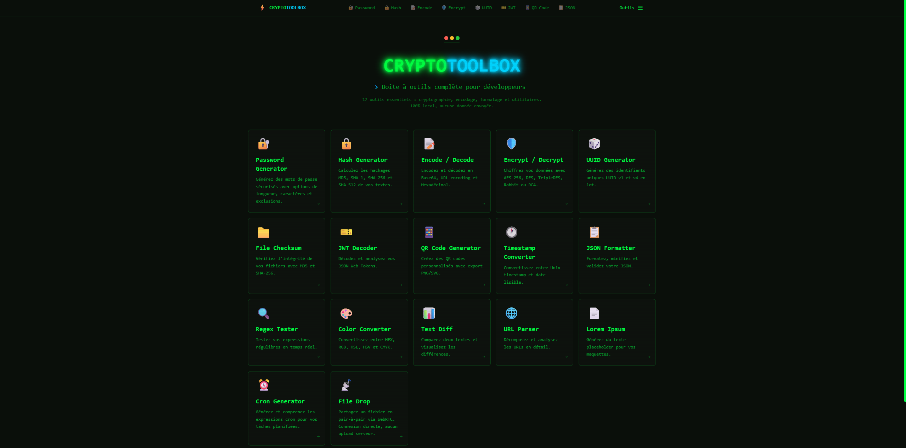

# ⚡ CRYPTO TOOLBOX

Une boîte à outils complète pour développeurs avec une interface moderne style **terminal/hacker**.




## 🎨 Aperçu

Interface sombre style Matrix avec :
- 🟢 Texte vert néon (`#00ff41`)
- 🔵 Accents cyan (`#00d4ff`)
- ⬛ Fond noir profond (`#0a0f0a`)
- 💻 Police monospace (JetBrains Mono)
- ✨ Effets glow et scanlines

## 🛠️ Les 16 Outils

### 🔐 Sécurité

| Outil | Description |
|-------|-------------|
| **Password Generator** | Génération de mots de passe sécurisés (4-128 caractères), indicateur de force |
| **Hash Generator** | MD5, SHA-1, SHA-256, SHA-512 avec affichage simultané |
| **Encrypt / Decrypt** | AES-256, Triple DES, Rabbit, DES, RC4 avec indicateurs de sécurité |
| **File Checksum** | Vérification d'intégrité MD5/SHA-256 via drag & drop |

### 📝 Encodage

| Outil | Description |
|-------|-------------|
| **Encode / Decode** | Base64, URL encoding, Hexadécimal |
| **JWT Decoder** | Décodage Header/Payload, détection d'expiration |
| **QR Code Generator** | Thèmes personnalisés, export PNG/SVG, fond transparent |

### 📊 Données

| Outil | Description |
|-------|-------------|
| **JSON Formatter** | Beautify, Minify, Validate, Sort Keys, vue Tree |
| **UUID Generator** | UUID v1 (timestamp) et v4 (random), génération en lot |
| **Timestamp Converter** | Unix ↔ Date avec références et raccourcis |

### ✏️ Texte

| Outil | Description |
|-------|-------------|
| **Regex Tester** | Test en temps réel, highlighting, patterns courants |
| **Text Diff** | Comparateur de textes avec highlighting des différences |
| **Lorem Ipsum** | Générateur de texte placeholder (mots, phrases, paragraphes) |

### 🌐 Web & Système

| Outil | Description |
|-------|-------------|
| **URL Parser** | Décomposition complète des URLs, gestion des paramètres |
| **Color Converter** | HEX, RGB, HSL, HSV, CMYK avec preview |
| **Cron Generator** | Expressions cron avec presets et explications en français |

## 🚀 Installation

```bash
# Cloner le repository
git clone https://github.com/Aprilox/crypto-toolbox.git
cd crypto-toolbox

# Installer les dépendances
npm install

# Lancer le serveur de développement
npm run dev
```

Ouvrir [http://localhost:3000](http://localhost:3000) dans votre navigateur.

## 📦 Dépendances

| Package | Usage |
|---------|-------|
| `next` | Framework React |
| `react` | Interface utilisateur |
| `crypto-js` | Hachage et chiffrement |
| `uuid` | Génération d'UUIDs |
| `qrcode` | Génération de QR codes |
| `tailwindcss` | Styling |

## 🔒 Sécurité & Confidentialité

- ✅ **100% local** - Aucune donnée n'est envoyée à un serveur
- ✅ **Pas de tracking** - Aucun analytics ou cookie
- ✅ **Open source** - Code vérifiable
- ✅ **Crypto Web API** - Utilise les APIs natives du navigateur

## 📁 Structure du Projet

```
app/
├── page.tsx                 # Page d'accueil (16 outils)
├── globals.css              # Thème terminal/Matrix
├── layout.tsx               # Layout principal
├── components/
│   ├── Navbar.tsx           # Navigation responsive
│   ├── ToolCard.tsx         # Carte d'outil
│   └── CopyButton.tsx       # Bouton copier
└── tools/
    ├── password/            # Générateur de mots de passe
    ├── hash/                # Hachage
    ├── encode/              # Encodage/Décodage
    ├── encrypt/             # Chiffrement
    ├── uuid/                # Générateur UUID
    ├── checksum/            # Checksum fichiers
    ├── jwt/                 # Décodeur JWT
    ├── qrcode/              # Générateur QR Code
    ├── timestamp/           # Convertisseur Timestamp
    ├── json/                # Formateur JSON
    ├── regex/               # Testeur Regex
    ├── color/               # Convertisseur Couleurs
    ├── diff/                # Comparateur Texte
    ├── url/                 # Parser URL
    ├── lorem/               # Générateur Lorem Ipsum
    └── cron/                # Générateur Cron
```

## 🎯 Scripts Disponibles

```bash
npm run dev      # Serveur de développement (port 3000)
npm run build    # Build de production
npm run start    # Serveur de production (port 8001)
npm run lint     # Vérification ESLint
```

## 📄 Licence

MIT License - Libre d'utilisation et de modification.

---

<p align="center">
  Fait avec 💚 et beaucoup de <code>crypto</code>
</p>
